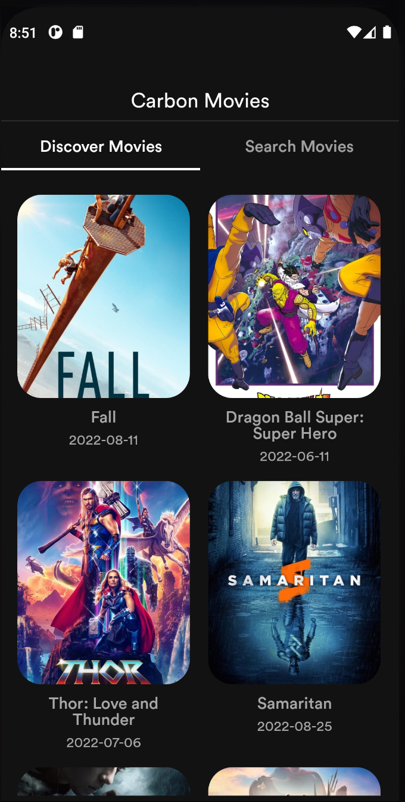
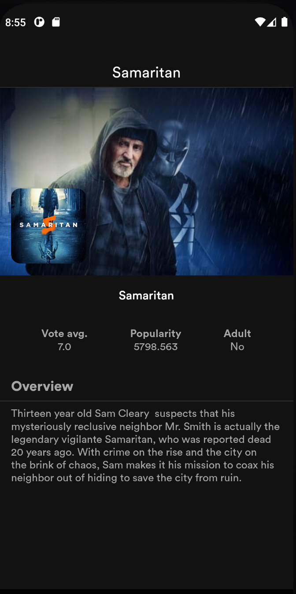

# CarbonMovies
An android App that displays a list of movie items and their detail when clicked on using themoviedb API - https://www.themoviedb.org/ . 

The application follows clean architecture and has layers separated into different gradle modules namely:

- Domain
- Data
- Cache
- Remote

#### Domain
The domain layer contains the app business logic.

#### Data
The Data layer implements the contract for providing data defined in the domain layer.

#### Presentation
I used the MVVM pattern for the presentation layer.

## Libraries

Libraries used in the application are:
- [Jetpack](https://developer.android.com/jetpack)
  - [Viewmodel](https://developer.android.com/topic/libraries/architecture/viewmodel) - Manage UI related data in a lifecycle conscious way
  and act as a channel between use cases and UI.
  - [Data Binding](https://developer.android.com/topic/libraries/data-binding) - support library that allows binding of UI components in layouts to data sources.
  - [LiveData](https://developer.android.com/topic/libraries/architecture/livedata) - Provides an observable data holder class.
- [Retrofit](https://square.github.io/retrofit/) - type safe http client and supports coroutines out of the box.
- [okhttp-logging-interceptor](https://github.com/square/okhttp/blob/master/okhttp-logging-interceptor/README.md) - logs HTTP request and response data.
- [Shimmer](https://facebook.github.io/shimmer-android/) - Shimmer provides an easy way to add a shimmer effect to views in the application.
- [kotlinx.coroutines](https://github.com/Kotlin/kotlinx.coroutines) - Library Support for coroutines. I used this for asynchronous programming in order
to obtain data from the network.
- [MockWebServer](https://github.com/square/okhttp/tree/master/mockwebserver) - web server for testing HTTP clients ,verify requests and responses on the tmdb api with the retrofit client.
- [Material Design](https://material.io/develop/android/docs/getting-started/) - build awesome beautiful UIs.
- [JUnit](https://junit.org/junit4/) - This was used for unit testing the various layers.
- [Truth](https://truth.dev/) - Assertions Library, provides readability as far as assertions are concerned.
- [Hilt](https://dagger.dev/hilt/) - Dependency injection plays a central role in the architectural pattern used.
- [Robolectric](http://robolectric.org/) - Unit test on android framework.
- [Ktlint](https://github.com/pinterest/ktlint) - A Kotlin linter with built-in formatter.
- [Coil](https://github.com/coil-kt/coil) - Image loading for Android backed by Kotlin Coroutines.

## Testing
Testing is done with Junit4 testing framework, and with Google Truth for making assertions.

## Screenshots
||||
